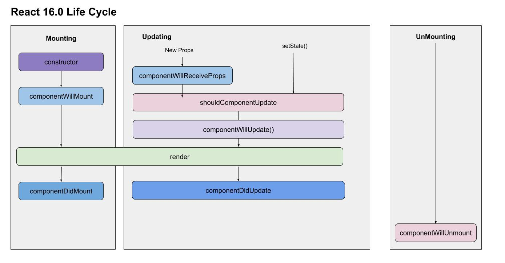

% Introdução aos containers Docker 
% Claudia Sampedro & Igor Faustino

# Introdução ao desenvolvimento Front-end

- Desenvolvimento de codigos que são processados no computado do cliente.
    - Executados comumente no navegador
    - ajuda a poupar recursos do servidor
- Exemplos:
    - sites
    - sistemas WEB

# Tecnologias WEB

- HTML
- CSS
- Javascript
    - TUDO O QUE VC IMAGINAR
        - react tá aqui....

# Componentes

- Blocos de codigos reusaveis
- Independentes
- basicamente... uma peça de lego.

# React JS

- Biblioteca Javascript
- Desenvolvido pelo facebook
- Baseado em componentes
- utiliza o jsx
    - Uma nova versao do javascript

# criando um novo projeto

- Realiza toda a configuração necessaria
- Modo mais facil e rapido de criar um projeto React

###
``` bash
$ npx create-react-app nome_app
$ cd nome_app
$ npm start
```

# Organização inicial do projeto

``` bash
node_modules/ # dependencias do projeto
public/ # arquivos estaticos
src/ # Codigo fonte
    App.css # estilo padrao do componente APP
    App,js # Componente padrao
    App.test.js # Arquivo de teste do componente
    index.js # Ponto de entrada de uma aplicação react
    srviceWorker.js # Configuração para progressive Web Apps
package.json # arquivo de configurações
package-lock.json # gerencia modificações das dependencias
```

# Dicas para organização

- Não existe verdade absoluta
- Necessario observar uma organização que funcione para cada time

### Porem...
- Uma boa organização deve possibiliar voce se encontrar no projeto depois de certo tempo
- Fazer sentido
- Ser facil de manter

# Sugestão de organização

- Organização de projetos que eu utilizo

``` bash
src/
    components/ # Componentes criados
    pages/ # paginas do sistema
    utils/ # funções uteis para o desenvolvimento
    routes/ # gerenciador de rotas para navegação
    index.js
    App.js
```

# Criação de um componente React

## Informações do componente

**Estado**

Informações Armazenadas dentro do componente

**Props**

Informações externas ao componente

## Formas de criar um componente

**Classes**

Componentes podem possuir um estado

**Funções**

Componentes sem estado

# Criação de um componente React

```js
import React, { Component } from 'react'

export default class MeuComponente extends Component {
    render() {
        return (
            <div>
                sou um componente
            </div>
        )
    }
}
```

# Ciclo de vida



# Rotas

- Permite a troca de componentes baseado na URL

### Instalação
``` bash
$ npm install react-router-dom
```

# Rotas

``` js
import React from "react";
import { BrowserRouter, Route } from "react-router-dom";

import page1 from "../pages/page1"
import page2 from "../pages/page2"

function AppRouter() {
    return (
        <BrowserRouter>
            <Route path="/page1" exact component={page1} />
            <Route path="/page2" exact component={page2} />
        </BrowserRouter>
    );
}

export default AppRouter;
```

# Mão na massa

